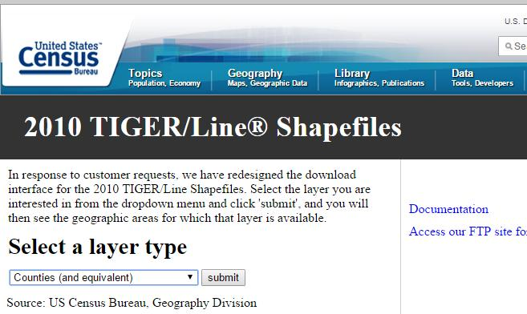
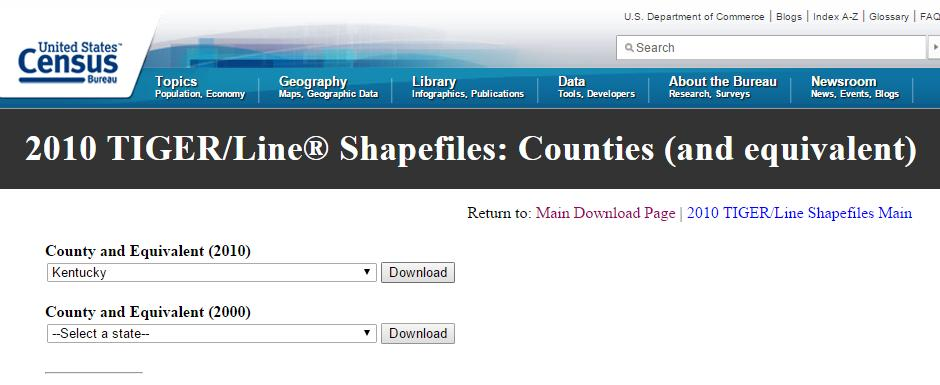
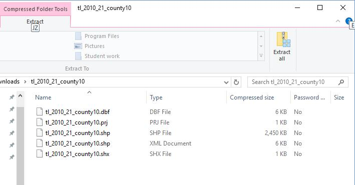
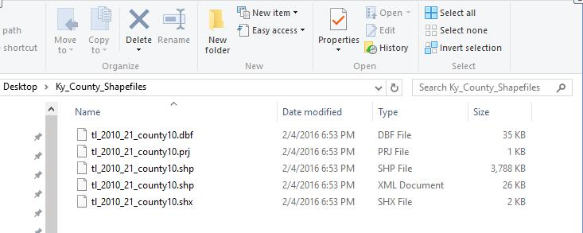
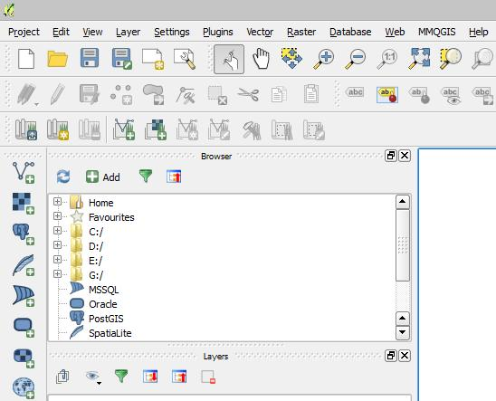
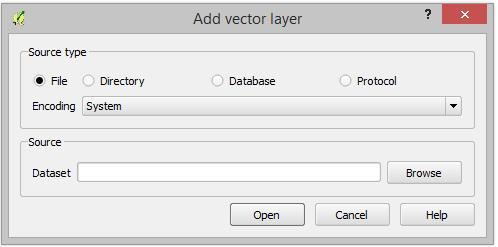
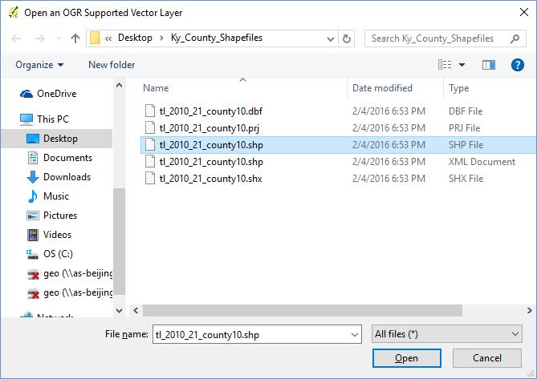
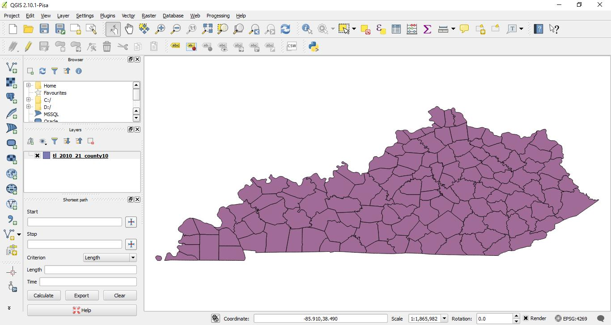
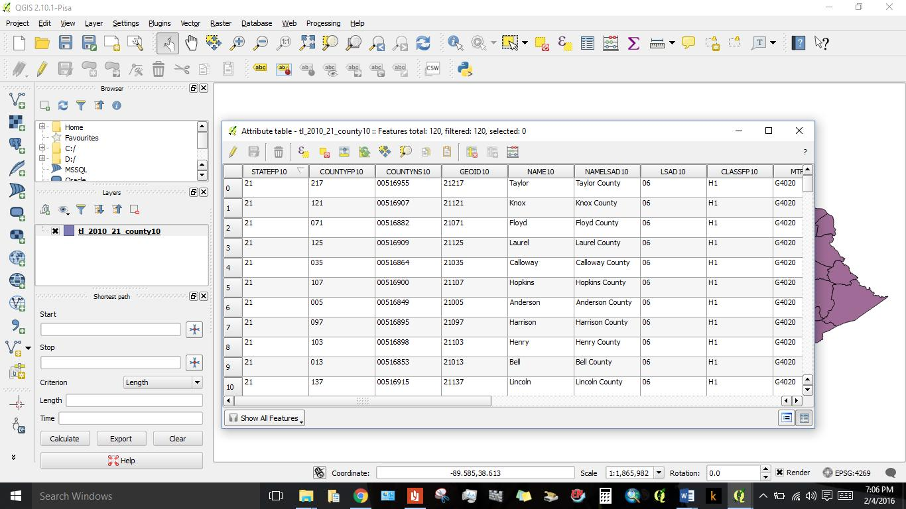

# Geography 109: Digital Mapping

# Mapping 4: Introduction to QGIS: Part 1

> [Mapping 4](../README.md) - [Install QGIS](../Install_QGIS/M4_Install_QGIS.md) - [**Part 1**](M4_Part_1.md) - [Part 2](../Part_2/M4_Part_2.md) - [Part 3](../Part_3/M4_Part_3.md)

___

This exercise involves a mapping process commonly used by professional cartographers. As such, you’ll use data in new ways—be patient! By engaging more deeply with data, you’ll start to understand the moving parts of making digital maps that are often hidden from their users.

In particular, this assignment will introduce data preparation in Microsoft Excel and visualization in QGIS, a free and open-source software (FOSS). The 3-part assignment will be completed over the three recitation sections. **Before section** week 5, download QGIS to your computer. In section, you will import county geometry. Second, during week 6, you will download tabular data from FactFinder2 and use Excel to clean the data.

### This assignment will take three recitation sections to complete; therefore it is crucial that you attend each recitation and arrive on time.

**Due:** Consult the [syllabus schedule](../../syllabus.md#viii-schedule) for the due date of this assignment.

**Note:** You must come to recitation week 5 with QGIS installed.

Part 1 questions must be answered and shown on your screen at the beginning of section Week 6.

You will receive points in section for having these parts done. Be conscious of saving and storing your data, either on a thumbdrive, space you know is secure on the UK drive, on cloud storage, or your laptop. It is your responsibility to save your data securely.

### Grading and Deliverables 

The assignment is worth 50 points. Grading will be based on a Word document that you will upload to Canvas during Week 8. This document should include:

1. Your two exported maps (20 points),
2. Your responses to the questions in each part (30 points)

## Part 1. Importing Geospatial Data

1. Now that you’ve successfully installed QGIS, it’s time to download some geospatial data. Navigate to http://census.gov/cgi-bin/geo/shapefiles2010/main. Under **_Select a layer type_** choose **_Counties (and equivalent)_** and click submit.

2. Under the **_2010_** dropdown menu (not the 2000 menu below), select **_Kentucky_** and click Download.

3. The shapefile you just downloaded is in a compressed folder – a ZIP file – that you must _extract_. Use the technique you learned in M2 to extract _all_ the files and save them to somewhere easy to find again, like a folder on your desktop made for this purpose (remember that the shapefile is actually 5 different files). All of these files are necessary components of the shapefile’s data structure. They must all stay in the same folder or the file will not work correctly.

4. Open QGIS. The interface should look familiar after learning ArcGIS. The two platforms are fairly similar and ‘think’ in the same way (mostly).

5. Click **_Add Vector Layer_** on the left side of the screen. In the Add Vector Layer dialogue box, click the **_Browse_** button to locate your shapefile.

    * If you're using QGIS 3.2 and cannot see this sidebar, click View > Toolbars > Manage Layers Toolbar.

6. Locate the folder that contains your shapefile and click the file ending in “.shp.” **Note: this is potentially confusing as there are other files that also have the .shp extension (e.g.,shp.xml)** and sometimes the extension will be hidden. Take a close look; you may have to experiment a bit before you find the right file. Click “Open” and “Open” again in the “Add Vector Layer” dialogue box.

    * In QGIS 3.2, you will click "Open", then "Add", and finally "Close" in the Data Source Manager dialogue box.

Congratulations! You’ve just made a map in QGIS! Your shapefile should now be displayed in the map window and in the QGIS list of active layers.

7. Open the attribute table of the layer: you will see this option when you right-click the layer. You can use the information in here to answer Question 2.

### Part 1 Questions

Respond to each of the following questions. Make sure you provide evidence for your claims, in 150 to 300 words for question 1. For question 2, you can also provide an explanation of how you came up with your percentage.

1. What does it mean to say that QGIS is free and open-source software (FOSS)? What are the implications for ‘expert’ cartography and access to mapmaking technology? Do some research and **cite your sources**.

2. How much of Bourbon County is under water? Use the attribute table to find **this percentage**. Hint: ALAND10 and AWATER10 will be helpful here. If you are not sure what these variable names mean, try a Google search. Note that these attributes are given in units of square meters.

**_You will continue with Part 2 of the lab in Week 6._**

___

> [Mapping 4](../README.md) - [Install QGIS](../Install_QGIS/M4_Install_QGIS.md) - [**Part 1**](M4_Part_1.md) - [Part 2](../Part_2/M4_Part_2.md) - [Part 3](../Part_3/M4_Part_3.md)
