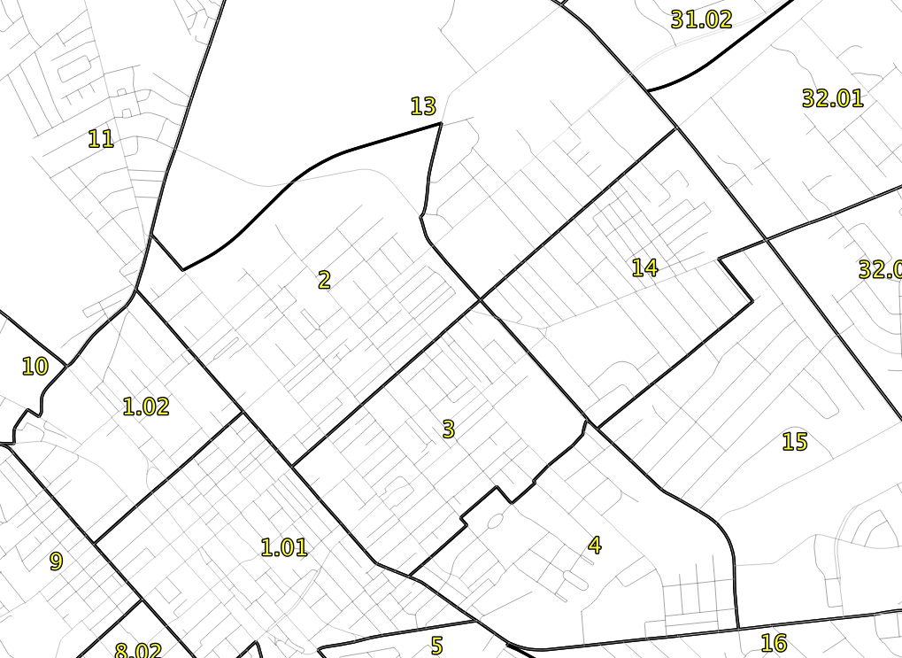

# Geography 509:  Workshop in Geospatial Technologies

University of Kentucky
 Matthew W. Wilson

## Site Analysis

In this assignment, you will complete an initial site analysis of the study area using GIS, to include primary and secondary spatial data. Feel free to partner with other members of the class. Each student must submit their own site analysis.

For those who have not used QGIS or US Census table joins are encouraged to complete a [tutorial](https://www.qgistutorials.com/en/docs/3/performing_table_joins.html) to become more familiar with this technology and the use of census data.

### Read an article and go on a walk.

To complete the site analysis, you need to read an article and go on a walk:

  1. Read Richard H. Schein. 2012. [Urban Form and Racial Order](https://www.tandfonline.com/doi/abs/10.2747/0272-3638.33.7.942). Urban Geography 33 (7):942-960. Article is available on Canvas.
  2. Complete a 'mapwalk' in northeast Lexington. Plan a walking route that includes two locations mentioned in the Schein article: [Hampton Court Gate](https://goo.gl/maps/kR2RYp1Yq7r) and [Rose Hill](https://goo.gl/maps/gGi2aiun6942). You may also want to visit the [January House](https://goo.gl/maps/dUpfrwLLM942).
  3. Take notes and photos of things you notice about the landscape. Note the architecture, lot-size, building quality, presence of driveways, etc.
  
### Schedule some computer time.

You also need to explore some aspects of northeast Lexington using data from the US Census. [Read more](https://www.census.gov/content/dam/Census/library/publications/2018/acs/acs_general_handbook_2018_ch01.pdf) about the difference between the American Community Survey and the Decennial Census. You'll then need to do some work using GIS:

  1. Use the [Lexington Data Hub](https://data-lfucg.hub.arcgis.com/search) to download spatial data for your basemap of Lexington (including revised census geometries for 2020. 
  2. Use [Data.Census.Gov](http://data.census.gov) to download census tabular data (as CSV) for Lexington based on a theme of interest (housing, employment, income, race and ethnicity, transportation, veteran status, etc.). You may want to explore census data first using [Social Explorer](https://www.socialexplorer.com/).
  3. Perform a table join to connect the tabular data with your census geometries.
  4. Create a few choropleth maps showing aspects of this data.
  
### Assemble materials into a PDF.

To complete the site analysis, assemble your notes, photos, and maps into a single PDF describing some aspect of northeast Lexington. Analysis should highlight and prioritize more formal lines of inquiry that may be pursued throughout the semester. You may want to identify potential community partners that could be engaged during the studio. Make note of any work completed with other class members. Upload the PDF to Canvas for full credit.
