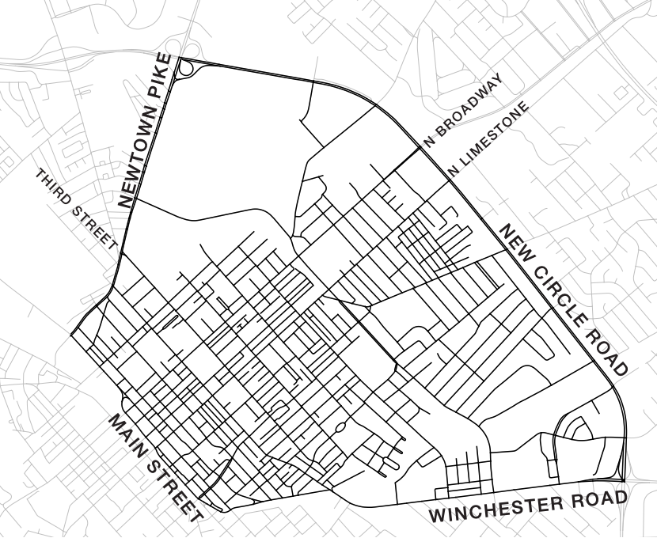

# Geography 509:  Community Mapshop

University of Kentucky
 Matthew W. Wilson

## Site Analysis

In this assignment, students will complete an initial site analysis of the study area using GIS, to include primary and secondary spatial data. Analysis should highlight and prioritize more formal lines of inquiry that will be pursued throughout the semester, with an identification of potential community partners that could be engaged during the studio.

For those who have not used QGIS or FactFinder are encouraged to complete a [practice lab](https://wilsonism.github.io/geo109/mapping-4/) to become more familiar with this technology and the use of census data.

To complete the site analysis, you are to:

  1. Use the [Lexington Open Data Portal](https://data.lexingtonky.gov/group) to download shapefiles for your basemap of Lexington (including revised census tract and block geometries for [2010](https://data.lexingtonky.gov/group/miscellaneous) and [2000](https://data.lexingtonky.gov/group/historical?page=2)). 
  2. Use [FactFinder](http://factfinder.census.gov) to download census tabular data for Lexington based on a theme of interest (housing, employment, income, race and ethnicity, transportation, veteran status, etc.). You may want to explore census data first using [Social Explorer](https://www.socialexplorer.com/). You may want to learn more about using Social Explorer, [here](https://wilsonism.github.io/geo109/mapping-3/mapping-3-instructions.html).
  3. 